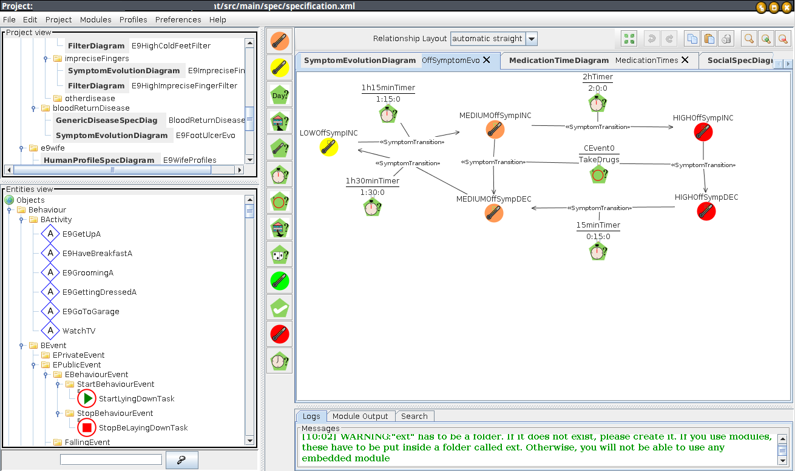

 
There are several editors generated with INGENME. Following, there are references to some downloadable ones:

- SociAALML. A visual language for the specification of Ambient Assisted Living. Github hosted into [https://github.com/Grasia/sociaalml](https://github.com/Grasia/sociaalml). The project using the editors is [SociAAL](http://grasia.fdi.ucm.es/sociaal).

- SelfMML. A visual language for the specification of selfmanagement systems. Hosted into [http://selfmml.sourceforge.net/](http://selfmml.sourceforge.net/)

- INGENIAS. A visual language for the specification of Multi-Agent Systems. Hosted into [http://ingenias.sf.net](http://ingenias.sf.net)

